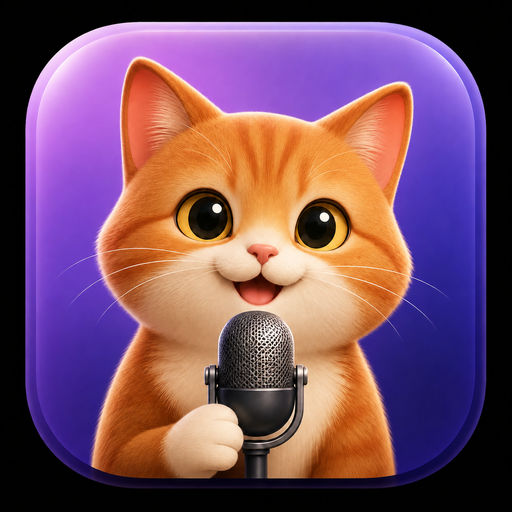
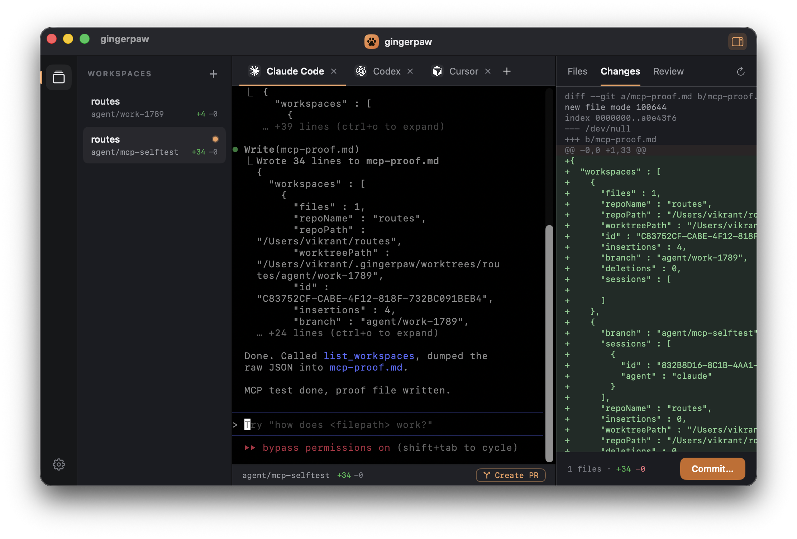
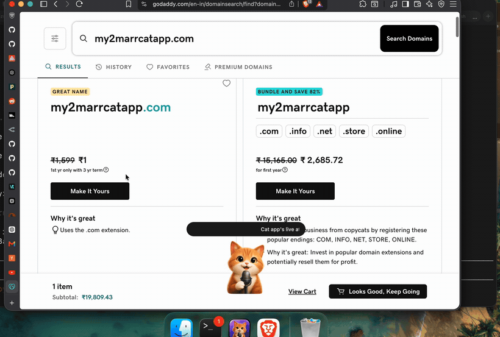

<div align="center">



# GingerPaw

**A multi-agent coding workspace for macOS — with on-device voice. Fully local.**

Run a whole team of coding agents in parallel — Claude Code, Codex, Gemini CLI, Cursor —
each in its own git worktree. Agents can even spawn their own workspaces and launch other
agents. Plus push-to-talk dictation and a talking ginger cat that speaks (in a neural voice)
when an agent finishes. Nothing ever leaves your Mac.

<br/>



</div>

---

## What it does

### 🖥️ Agent Workspace
Run multiple coding-agent CLIs side by side, each isolated:

- **A tab per agent** — Claude Code, Codex, Gemini CLI, Cursor — real interactive terminals (SwiftTerm PTYs) running in-app.
- **Git worktrees** — every workspace is a worktree on its own branch under `~/.gingerpaw/worktrees`, so agents work in parallel with zero collisions.
- **Live diff panel** — Files / Changes / Review with `+/−` counts, one-click **Commit**, and **Create PR** (via `gh`).
- **Ports + branch status** — detected dev-server ports and ahead/behind, right in the status bar.
- Agents launch with auto-approve flags — safe, because each is sandboxed to its own worktree.

### 🤖 Agents that orchestrate agents (MCP)
GingerPaw runs an MCP server, so an agent running *inside* a workspace can drive the cockpit:
**create new workspaces, launch other agents with a task, and read their diffs back.** Ask one
agent for something and a whole team shows up in your sidebar, working in parallel — all visible
and steerable. A `.mcp.json` is auto-wired into every worktree (Claude Code) and `~/.codex/config.toml` (Codex).

### 🐈 Voice + dictation
- **Push-to-talk dictation** — hold **Fn or Right Option**, speak, release; transcribed on-device with [WhisperKit](https://github.com/argmaxinc/WhisperKit) and pasted into any app.
- **Talking-cat notifications** — when a coding agent finishes, a ginger cat pops up and speaks a summary in a natural **Kokoro (82M) neural TTS** voice (or macOS `say`). Walk away and still know when it's done.

All on-device. No cloud, no account.

The talking cat works out of the box with the macOS `say` voice. For the **Kokoro
neural voice**, open the **Voice** tab and click **Install Kokoro voice** — it sets up
an isolated Python venv and downloads the 82M model (~200MB, needs `python3`). Until then
it falls back to `say`.

<sub></sub>

## Requirements

- macOS 14+ (Apple Silicon)
- Xcode 16+ with the Metal Toolchain (`xcodebuild -downloadComponent MetalToolchain`) — required to compile MLX's GPU shaders.
- [XcodeGen](https://github.com/yonaskolb/XcodeGen) (`brew install xcodegen`)
- The agent CLIs you want to use (`claude`, `codex`, `gemini`, `cursor-agent`) on your `PATH`.
- `gh` (optional) for Create PR. Kokoro TTS (optional) for the neural voice.

## Build

```sh
xcodegen generate                                    # project.yml -> GingerPaw.xcodeproj
xcodebuild -project GingerPaw.xcodeproj -scheme GingerPaw \
  -configuration Debug -derivedDataPath ./dd build
```

> MLX requires Xcode's build system to compile the Metal kernels — a plain `swift build` will not produce the metallib. Use `xcodebuild` (or open the project in Xcode).

The build is self-contained: a build phase also compiles and bundles `gingerpaw-cli`
(the voice + MCP helper) into the `.app`, so a fresh clone builds a complete, runnable app —
no extra steps. First launch downloads the WhisperKit model once; grant the three permissions
below. Install the agent CLIs you want (`claude`, `codex`, `gemini`, `cursor-agent`) to use the
Agent Workspace.

Run `swift test` inside `Packages/FlowKit` for the unit tests.

## Permissions

GingerPaw needs three macOS grants (surfaced in the in-app **Permissions** tab):

| Grant | Why |
|-------|-----|
| Microphone | Record your voice for transcription |
| Input Monitoring | Detect the push-to-talk hotkey globally |
| Accessibility | Paste text into the focused app |

## Architecture

A thin SwiftUI app shell (`App/`) over **FlowKit** (`Packages/FlowKit`), a SwiftPM package of focused libraries:

- `AgentWorkspace` — the multi-agent window: SwiftTerm terminals, git worktrees, the diff panel, ports/PR, and the **MCP bridge** (`MCPBridgeServer`) that lets agents drive the app over a loopback socket.
- `AgentMCP` — shared Codable types for the MCP bridge (kept dependency-light so the `gingerpaw-cli` MCP binary stays small).
- `AgentNotifications` — the `<say>` transcript parser + speech service shared by the app and the `gingerpaw-cli` hook binary.
- `Dictation` — the `DictationCoordinator` state machine · `Audio` · `Transcription` (WhisperKit) · `TextInsertion`.
- `TextProcessing` — MLX/Qwen formatter (experimental) · `Hotkeys` (global `CGEventTap`) · `Permissions` (TCC) · `Overlay` · `Settings`.
- `AppCore` — composition + UI: the Agent Workspace, Dictate / Voice / Permissions / Settings, and the talking cat.

`gingerpaw-cli` is the bundled helper binary: `notify` (the Claude Code voice hook) and `mcp` (the MCP server agents connect to).

## License

MIT
